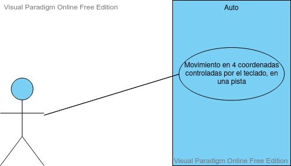

# Proyecto Semestral
## Integrantes  

- Daniela Alejandra Novoa Opazo
- Jorge Ignacio Santis Martinez
 
 ## Enunciado del problema elegido  
 Tema 5: Vehículo dirigido por teclado y moverse por pista sensible con bordes que detectan y cuentan colisiones  
 
El panel principal debe contener una ruta cerrada, con curvas y soleras creadas (representadas por Polygon). Las ruedas delanteras deben se visibles y deben reflejar la dirección si dobla. El usuario deberá controlar la dirección de las ruedas con las flechas del teclado. El móvil debe moverse siguiendo la dirección de las ruedas delanteras de manera similar a uno real. Las ruedas no tienen que girar sólo mostrar en la vista aérea su dirección. El control de velocidad se debe realizar mediante controles GUI. La ruta debe ser configurable por controles GUI: ancho y alto la pista y ancho de la calzada. Debe tener dos modos: configuración y conducción.  

## Use Case Diagram  
  
    
    
 ## Diagrama del UML  
   
  .jpg)  
    
  ## Imagen de la Interfaz  
    
  ## Lista de cosas qué no sabemos hacer y/o que nos faltan
  1. Soleras: Problemas para crearlas visualmente y que tengan colisiones al chocar con el auto.  
     - Estado: por consultar  
  2. Movimiento del Auto: Problemas para que el auto rote con el movimiento.  
      - Estado: resuelto.  
  3. Creación de Ruedas: Falta crear ruedas para el auto que se muevan en la dirección de este.  
      - Estado: por consultar  
  4. Dudas con clase Polygon: No se ha ocupado la clase Polygon hasta el momento y hay dudas sobre su implementación  
       -Estado: resuelto.
  5. Creacion de Test Unitarios: Todavía falta crear test unitarios, y hay dudas sobre su elaboración  
       -Estado: por consultar.
  6. Creación de Javadoc: Se esta esperando a alcanzar las etapas finales del trabajo para incluir los javadoc
       -Estado: por crear
  7. Separar en packages: Falta ordenar en packages
       -Estado: por crear
       
