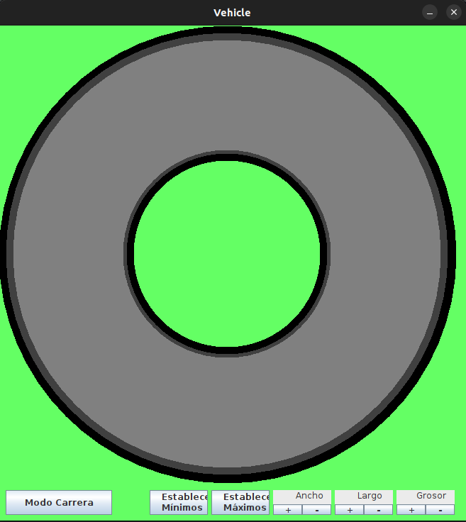

# Proyecto Semestral
## Integrantes (Grupo 13)  

- Daniela Alejandra Novoa Opazo
- Jorge Ignacio Santis Martinez
 
 ## Enunciado del problema elegido  
 Tema 5: Vehículo dirigido por teclado y moverse por pista sensible con bordes que detectan y cuentan colisiones  
 
El panel principal debe contener una ruta cerrada, con curvas y soleras creadas (representadas por Polygon). Las ruedas delanteras deben se visibles y deben reflejar la dirección si dobla. El usuario deberá controlar la dirección de las ruedas con las flechas del teclado. El móvil debe moverse siguiendo la dirección de las ruedas delanteras de manera similar a uno real. Las ruedas no tienen que girar sólo mostrar en la vista aérea su dirección. El control de velocidad se debe realizar mediante controles GUI. La ruta debe ser configurable por controles GUI: ancho y alto la pista y ancho de la calzada. Debe tener dos modos: configuración y conducción.  

## Use Case Diagram  
  
  .jpg)  
    
 ## Diagrama del UML  
   
  .jpg)    
  
  ## Lista y Justificación de Patrones Utilizados  
  
  En la clase Ventana hicimos uso del Patrón Singletón, porque el llamado a Ventana debe tener sólo una instancia la cuál será mostrada en pantalla. 
    
  ## Imagen de la Interfaz  
  
    
   
   ## Decisiones que hemos tenido que tomar durante el proyecto  
   
   Procederemos a nombrar nuestras principales decisiones creativas y críticas respecto a este proyecto:  
   
   - Al principio del proyecto nuestras más primordiales decisiones se vieron reflejadas a la hora de la creación de la clase Pista, deliberamos que sería más creativo hacer uso de una pista de forma circular por lo que no vimos necesario hacer uso de la clase Polygon en ningún momento, y al ser esta visión aprobada por nuestro ayudante decidimos seguir adelante con su ejecución.  
   
   - Para la clase Auto, creamos a  un auto y ruedas a partir de sus centros, y a base de muchas funciones trigométicas que también fueron ocupadas para crear sus movimientos.  
       
   - Por otro lado, también decidimos agregar un menú, separado por modo edición y modo carrera, en el modo edición se puede modificar el ancho, alto y grosor de la pista mientras que en el modo carrera se puede hacer uso de la pista creada para utilizar el Auto.  
   
   - Una de las ideas que decidimos no implementar al final fue la de la creación de un contador de vueltas y colisiones, en primer lugar porque dictaminamos que era innecesario para el proyecto, considerando que se buscaba priorizar que el auto se mantenga dentro de la pista, y en segundo lugar porque cuando el auto chocaba continuamente con las soleras era díficil de controlar además de dar una experiencia menos fluida para el usuario.
    
  ## Lista de cosas que no sabemos hacer  
  1. Soleras: Problemas para crearlas visualmente y que tengan colisiones al chocar con el auto.  
     - Estado: resuelto     
     - Integrante encargado: Daniela Novoa
  2. Movimiento del Auto: Problemas para que el auto rote con el movimiento.  
      - Estado: resuelto.  
  3. Creación de Ruedas: Falta crear ruedas para el auto que se muevan en la dirección de este.  
      - Estado: resuelto
  4. Dudas con clase Polygon: No se ha ocupado la clase Polygon hasta el momento y hay dudas sobre su implementación; específicamente para la creación de        la pista y soleras.   
       - Estado: resuelto 
      - Integrante encargado: Daniela Novoa y Jorge Santis
  5. Creacion de Test Unitarios: Todavía falta crear test unitarios, y hay dudas sobre su elaboración  
       - Estado: resuelto
       - Integrante encargado: Jorge Santis
  6. Creación de Javadoc: Se esta esperando a alcanzar las etapas finales del trabajo para incluir los javadoc
       - Estado: resuelto        
       - Integrantes encargado: Daniela Novoa  
  7. Separar en packages: Falta ordenar en packages  
       - Estado: resuelto         
       - Integrante encargado: Daniela Novoa
  8. Creación de Menu: Incluye modo edición dónde se puede modificar las medidas de la pista, y el modo carrera dónde el usuario puede controlar el auto.
       - Estado: resuelto  
       - Integrante encargado: Jorge Santis
  9. Colisión: Generar un choque entre las soleras y el auto en caso de que entren en contacto, junto con un contador que muestre la cantidad de veces que el auto colisionó.
       - Estado: resuelto, se decidió al final no implementar el contador de colisiones.    
       - Integrante encargado: Daniela Novoa  
       
  ## Problemas encontrados y Autocrítica  
  Si bien se pueden ver las problemáticas y dudas en la sección de "Listas de cosas qué no sabemos hacer" dónde se documentó los dilemas presentados durante el proyecto, se hará una breve recapitulación.  
  
  Este proyecto nos expusó a una variedad de conceptos nuevos en la programación, tales como los test unitarios, la creación de un javadoc y las separaciones en packages que si bien resultaron ser menos complicadas que pensabamos al principio nos enseñaron más sobre la organización y autocorrección constante que debe tener un programador respecto a su código.    
  
  Nuestro problema elegido en específico nos enseñó el valor de las funciones trigonométicas y de la matemática en general al momento de la creación de distintos métodos en nuestro proyecto.  
  
  Por último queremos hacer una autocrítica a nuestro trabajo en equipo, el que estimamos ser balanceado y lleno de compañerismo por parte de ambos integrantes.
